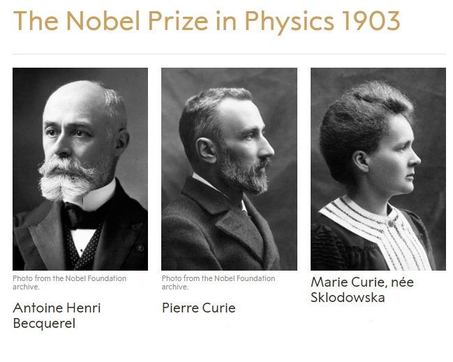
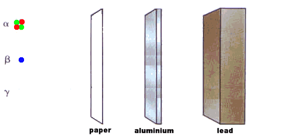
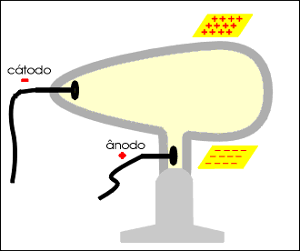
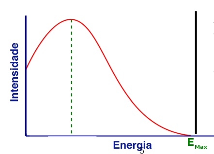
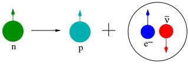
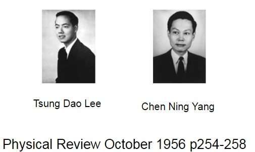
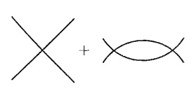

## Teoria de Fermi 
### para Interação Fraca
##### Gyell Gonçalves de Matos

*** =pnotes

Some notes on the first slide

---

### Uma Abordagem Histórica

.fragment Antoine Henri Becquerel 1986.

.fragment Marie Curie e Pierre Curie.

.fragment 

---

#### Rutherford faz sua contribuição (1899)

 

---

#### Becquerel e a razão $e/m$ (1900).

--- &vertical

### Rutherford e Soddy (1901)

--- &vertical

#### Lise Meitner e Otto Hahn (1911)
#### James Chadwick (1914)

.fragment 

.fragment 

--- &vertical 

# Pauli x Bohr

***

---

## A Teoria do Fermi!

.fragment Nêutron $\rightarrow$ Neutrino

.fragment $$\beta^{-}:n\rightarrow p+e^{-}+\bar{\nu}_{e}\\
     \beta^{+}:p\rightarrow n+e^{+}+\nu_{e}$$
     

.fragment $\beta^{+}$

---

## $$\mathcal{L}_{Fermi}=G_{F}\bar{\psi}_{p}\psi_{n}\bar{\psi}_{e}\psi_\nu,$$ 

---

### Interação 4-Fermi

.fragment Viola Paridade.

.fragment É não-renormalizável.

--- &vertical 

###  Parity Violation

.fragment  Otto Laporte demonstrou a lei de conservaçãode paridade (1924).

.fragment  Eugene Wigner, mostra a simetria por trás dessa lei (1927).

***

***

## Simetria de Reflexão

.fragment $$r=(x,y,z)\\r'=-r=(-x,-y,z)\\$$
(Eugene Wigner)

***

## Parity

.fragment $\sum_{j}p_{j}$ não se conserva.

.fragment $\prod_{j}p_{j}$ se conserva.

.fragment Após um evento teremos a parity oposta. 

--- &vertical 

### Interação 4-Fermi é não-renormalizáveis

- Super Renormalizável $\rightarrow d>0$
- Renormalizável  $\rightarrow d=0$
- Não-Renormalizável $\rightarrow d<0$

.fragment $$G_{F}=-2$$

***

## Métodos de Regularização.

***

#### Dimensão de $G_{F}$

.fragment $$\mathcal{L}=\bar{\psi}(\eth-m)\psi+G_{F}\bar{\psi}\psi\bar{\psi}\psi$$

.fragment $$I=\int\bar{\psi}\eth\psi d^{4}x$$

.fragment $$[dx]=-1\\
\left[\partial_{\mu}\right]=1\\
\left[I\right]=0.$$

.fragment $$\left[\bar{\psi}\right]=\left[\psi\right]=3/2$$

---

## Teorias não renormalizáveis

.fragment $$\mathcal{L}=G_{F}\bar{\psi}\psi\bar{\psi}\psi+a_{1}G_{F}^{2}\bar{\psi}\psi\Box\bar{\psi}\psi +a_{2}G_{F}^{3}\bar{\psi}\eth\psi\Box\bar{\psi}\eth\psi+\cdots$$ $a_{i}$'s são números.

--- &vertical 

### $\psi\psi\rightarrow\psi\psi$

.fragment 

***

### $\mathcal{M}_{tree}(s)\sim G_{F}+a_{1}G_{F}^{2}s+a_{2}G_{F}^{3}s^{2}+\cdots$
### $\mathcal{M}_{loop}(s)\sim G_{F}^{2}\left(b_{0}\Lambda^{2}+b_{1}s+b_{2}sln(\Lambda^{2}/s)\right)$

***

##### Bogolyubov, N. N., and D. V. Shirkov. "Introduction to Quantum Fields Theory." Nauka Eds, Moscow, 1973, Second edition, Revised. 416 pp. (1973).

--- 

#### $\mathcal{M}_{tree}+\mathcal{M}_{loop}\sim(G_{F}+G_{F}^{2}b_{0}\Lambda^{2})+sG_{F}^{2}(a_{1}+b_{1}+b_{2}ln\Lambda^{2})\\ -b_{2}G_{F}^{2}slns+a_{2}G_{F}^{3}s^{2}+\cdots$

--- &vertical 

### Processo de Renormalização

#### Counterterms

$$\mathcal{L}=Z_{F}G_{F}\bar{\psi}\psi\bar{\psi}\psi+Z_{1}a_{1}G_{F}^{2}\bar{\psi}\psi\Box\bar{\psi}\psi +Z_{2}a_{2}G_{F}^{3}\bar{\psi}\eth\psi\Box\bar{\psi}\eth\psi+\cdots$$

$$Z_{F}=1+\delta_{F}$$

*** 

#### $\mathcal{M}_{tree}+\mathcal{M}_{loop}+\mathcal{M}_{c.t}\sim(G_{F}+G_{F}^{2}b_{0}\Lambda^{2}+G_{F}\delta_{F})+\\sG_{F}^{2}(a_{1}+b_{1}+b_{2}ln\Lambda^{2}+a_{1}\delta_{1}) -b_{2}G_{F}^{2}slns+\cdots$

.fragment escolhendo $$\delta_{F}=-b_{0}\Lambda_{0}G_{F}, \\ \delta_{1}=-(1/a_{1})[b_{1}+b_{2}ln(\Lambda^{2}/s_{0})]$$

*** 

#### $\mathcal{M}(s)=\mathcal{M}_{tree}+\mathcal{M}_{loop}+\mathcal{M}_{c.t}\sim  G_{F}+sG_{F}^{2}[a_{1}-b_{2}ln(s/s_{0})]\\+a_{2}s^{2}G_{F}^{3}\cdots$

--- 

#### $$\frac{\mathcal{M}(s_{1})-G_{F}}{s_{1}G_{F}^{2}}-\frac{\mathcal{M}(s_{2})-G_{F}}{s_{2}G_{F}^{2}}\sim b_{2}ln\frac{s_{2}}{s_{1}}$$ 

---

### Lagrangianas de Tree-Level

### não dependem de 

### $$ln(s)$$

--- &vertical

### Apenas para Baixas Energias $E < G^{-1/2}$

.fragment UV Completing the Fermi Theory

.fragment Bosons Massivos ($W^{\pm};Z$)

.fragment __Eletrofraca__

***

$$\mathcal{L}_{M}=-\frac{1}{4}F_{\mu\nu}^{2}+\frac{1}{2}M^{2}W^{2}_{\mu}+\bar{\psi}(i\gamma_{\mu}\partial+g\gamma_{\mu}W)\psi,$$

onde

$$F_{\mu\nu}=\partial_{\mu}W_{\nu}-\partial_{\nu}W_{\mu}.$$

---

## ...

.fragment "...diferença na metodologia entre mecânica quântica não relativista e relação teoria quântica de campos...$V(\vec{r})$ que aparece na equação de Schrodinger é arbitrário...A mecânica não coloca limites sobre quais interações podem ser encontradas no mundo real... teoria quântica de campos impõe restrições muito estreitas na natureza (ou vice-versa)...a única
tarefas deixadas para os físicos de partículas são enumerar as partículas elementares que existem e medir suas massas e constantes de acoplamento... um sinal de que os físicos de partículas estão no caminho certo em direção a um teoria fundamental."

---

##### Refecências

>- JENSEN, C. Controversy and consensus: nuclear beta decay 1911–1934. [S.l.]: Springer Science
& Business Media, 1999. v. 24.

>- LESOV, A. The weak force: From fermi to feynman. arXiv preprint arXiv:0911.0058, 2009.

>- NOBEL PRIZE. Henri Becquerel. Disponível em:https://www.nobelprize.org/prizes/physics/
1903/becquerel/biographical/. Acesso em: 14 Novembro 2018.

>- NOBEL PRIZE. Marie Curie. Disponível em:https://www.nobelprize.org/prizes/physics/
1903/marie-curie/facts/. Acesso em: 14 Novembro 2018.

---

>- NOBEL PRIZE. Pierre Curie. Disponível em:https://www.nobelprize.org/prizes/physics/
1903/pierre-curie/facts/. Acesso em: 14 Novembro 2018.

>- PARISI, G. The theory of non-renormalizable interactions: The large n expansion. Nuclear
Physics B, Elsevier, v. 100, n. 2, p. 368–388, 1975.

>- PESKIN, M. E. An introduction to quantum field theory. [S.l.]: CRC Press, 2018.

>- WILCZEK, F. Quantum field theory. In: More Things in Heaven and Earth. [S.l.]: Springer,
1999. p. 143–160.

>- YANG, C. N. Fermi’s β-decay theory. International Journal of Modern Physics A, World
Scientific, v. 27, n. 03n04, p. 1230005, 2012.

---

.fragment https://gyell.github.io/4-Fermi-Theory

.fragment Obrigado!

